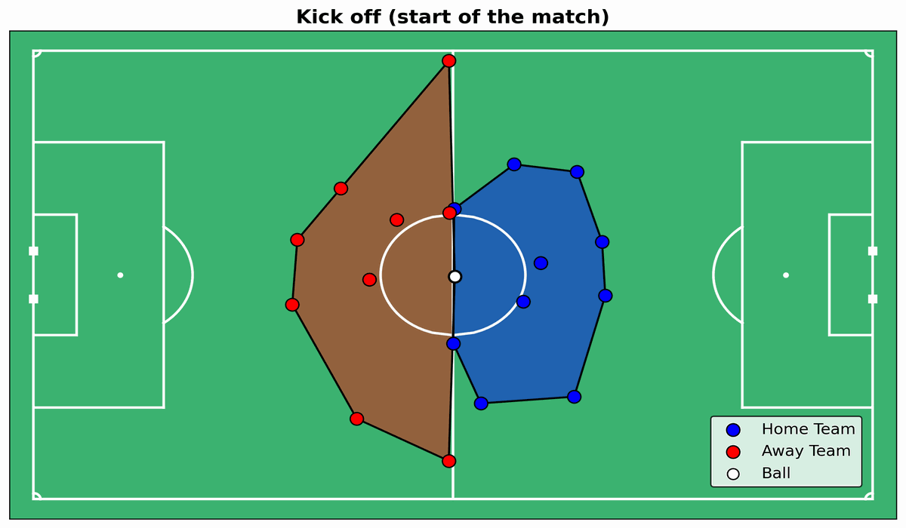

# Probabilistic Machine Learning Final Project

<div style="text-align: center;">
    
</div>

| Name | Surname | email | Master |
|:---:|:---:|:---:|:---:|
| Giulio | Fantuzzi | GIULIO.FANTUZZI@studenti.units.it | DSAI |
| Alessio | Valentinis | ALESSIO.VALENTINIS@studenti.units.it | DSAI |

## About the repository

```
├── data 
│   ├── hulls_df_matchday2.csv
│   ├── hulls_df_matchday2_reduced.csv
│   └── Sample_Game_2
│       ├── Sample_Game_2_RawEventsData.csv
│       ├── Sample_Game_2_RawTrackingData_Away_Team.csv
│       └── Sample_Game_2_RawTrackingData_Home_Team.csv
│
├── DataCleaning.ipynb
│
├── MatchAnalysis.ipynb
│
├── ModelComparison.ipynb
│
├── models
│   ├── BivariateHMM.py
│   ├── CopulaHMM.py
│   └── UnivariateHMM.py
├── papers
│
├── parameters
│
├── plots
│
├── utils
│   ├── ConvHulls.py
│   ├── CopulaHelpers.py
│   ├── Metrica_IO.py
│   ├── Metrica_Viz.py
│   ├── Plots.py
│   └── PredictHMM.py
│
└── VarInference.ipynb
```
## Data

The data used for the project is provided by the Metrica Sports company, which provides tracking data for football matches. The data is stored in the `data` folder, and it is organized in the following way:
- `Sample_Game_1`: the raw tracking data for the second match of the first matchday.
- `Sample_Game_2`: the raw tracking data for the second match of the second matchday.
- `away_xy.csv`: the x and y coordinates of the away team for the second match of the second matchday.
- `home_xy.csv`: the x and y coordinates of the home team for the second match of the second matchday.
- `hulls_df_matchday2.csv`: the hulls of the EPS for each frame of the match
- `hulls_df_matchday2_reduced.csv`: the hulls of the EPS for each frame of the match, grouped by 2 seconds, and cleaned from time intervals where the match stopped.
- `matchday2_events.csv`: the events of the match, such as goals, fouls, etc.

## Project Description

The project aims to infer on the Effective Playing Space (EPS) during a football match, using a copula-based HMM.

The project is implemented using Python, in particular relying on the following libraries:
- `numpy`
- `pandas`
- `matplotlib`
- `seaborn`
- `torch`
- `pyro`

For the implementation of the HMM we relied on the Probabilistic Programming Language Pyro.
All the functions used to define and train the model are implemented in the `models` folder. Other helper functions are implemented in the `utils` folder, such as the functions to compute the EPS, to plot and create GIFs of the pitch.

All the code regarding data cleaning, training of the model, and inference is implemented in the Jupyter Notebooks in the root folder.
